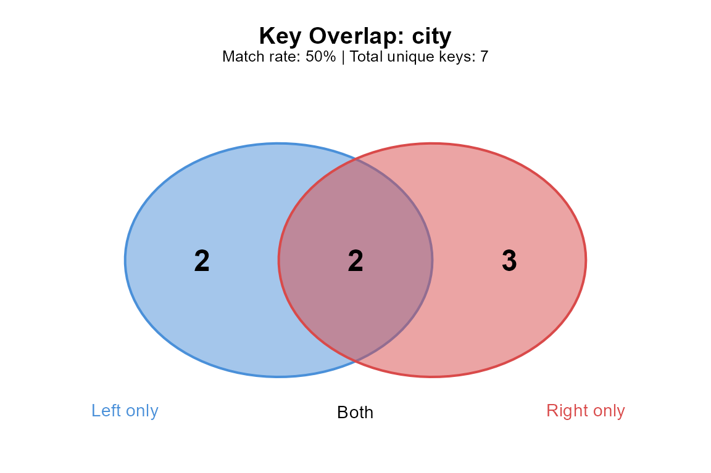

# Quick Start

An R join returns a well-formed data frame even when half the keys fail
to match. The row count is wrong, nothing warns, and the problem
surfaces later in a plot or a summary table that doesn’t add up. The
causes are usually mundane: a trailing space in a key column, a case
difference between two source systems, a duplicate key nobody expected.
None of these show up in [`str()`](https://rdrr.io/r/utils/str.html) or
[`head()`](https://rdrr.io/r/utils/head.html), and all of them silently
change what a join returns.

joinspy works in three stages. First, diagnose:
[`join_spy()`](https://gillescolling.com/joinspy/reference/join_spy.md)
inspects the key columns of two tables before they are joined, measures
the overlap, predicts the row count of every join type, and reports the
string-level problems that block matches (whitespace, case, encoding,
typos). Second, repair:
[`join_repair()`](https://gillescolling.com/joinspy/reference/join_repair.md)
fixes the mechanical problems in one call, with a dry-run mode to
preview the changes. Third, enforce:
[`join_strict()`](https://gillescolling.com/joinspy/reference/join_strict.md)
lets us declare the cardinality we believe the data has (`1:1`, `1:n`,
`n:1`, `n:m`) and errors if the data violates it, so the output row
count is predictable by construction. Around these three sit smaller
tools: a quick pass/fail gate
([`key_check()`](https://gillescolling.com/joinspy/reference/key_check.md)),
post-hoc forensics for joins that already happened
([`join_explain()`](https://gillescolling.com/joinspy/reference/join_explain.md),
[`join_diff()`](https://gillescolling.com/joinspy/reference/join_diff.md)),
a row-explosion warning
([`check_cartesian()`](https://gillescolling.com/joinspy/reference/check_cartesian.md)),
multi-step chain analysis
([`analyze_join_chain()`](https://gillescolling.com/joinspy/reference/analyze_join_chain.md)),
and logging for pipelines.

joinspy performs the actual join through the engine that matches the
data: plain data frames go through base
[`merge()`](https://rdrr.io/r/base/merge.html), tibbles through dplyr,
and data.tables through data.table. The diagnostic layer runs in front
of whichever engine is used, so the join semantics we already rely on
stay in place and adopting joinspy amounts to changing a function name.
The `*_join_spy()` wrappers drop in wherever a join already lives.

This vignette is the tour: a taste of every feature, with pointers to
the dedicated vignettes for depth.
[`vignette("why-keys-dont-match")`](https://gillescolling.com/joinspy/articles/why-keys-dont-match.md)
covers string forensics,
[`vignette("common-issues")`](https://gillescolling.com/joinspy/articles/common-issues.md)
catalogues problems and fixes,
[`vignette("backends")`](https://gillescolling.com/joinspy/articles/backends.md)
covers the three join engines, and
[`vignette("production")`](https://gillescolling.com/joinspy/articles/production.md)
covers logging and pipeline patterns.

## String Diagnostics

The keys *look* identical but differ at the byte level: a trailing
space, a case mismatch, an invisible Unicode character. These
differences don’t show up in [`str()`](https://rdrr.io/r/utils/str.html)
or [`summary()`](https://rdrr.io/r/base/summary.html) output, but they
determine whether a join matches.
[`join_spy()`](https://gillescolling.com/joinspy/reference/join_spy.md)
checks every key column on both sides and reports what it finds, grouped
by issue type and tagged with a severity. This section walks through the
categories one at a time;
[`vignette("why-keys-dont-match")`](https://gillescolling.com/joinspy/articles/why-keys-dont-match.md)
treats each in depth.

### Whitespace

Trailing and leading whitespace is the most common reason keys fail to
match. A column exported from Excel might contain `"London "` alongside
`"London"`, and R treats those as distinct values.

``` r

sales <- data.frame(
  city = c("London", "Paris ", " Berlin", "Tokyo"),
  revenue = c(500, 300, 450, 600),
  stringsAsFactors = FALSE
)

cities <- data.frame(
  city = c("London", "Paris", "Berlin", "Tokyo", "Madrid"),
  country = c("UK", "France", "Germany", "Japan", "Spain"),
  stringsAsFactors = FALSE
)

join_spy(sales, cities, by = "city")
#> 
#> ── Join Diagnostic Report ──────────────────────────────────────────────────────
#> Join columns: city
#> 
#> ── Table Summary ──
#> 
#> Left table: Rows: 4 Unique keys: 4 Duplicate keys: 0 NA keys: 0
#> Right table: Rows: 5 Unique keys: 5 Duplicate keys: 0 NA keys: 0
#> 
#> ── Match Analysis ──
#> 
#> Keys in both: 2
#> Keys only in left: 2
#> Keys only in right: 3
#> Match rate (left): "50%"
#> 
#> ── Issues Detected ──
#> 
#> ! Left column 'city' has 2 value(s) with leading/trailing whitespace
#> ℹ 2 near-match(es) found (e.g., 'Paris ' ~ 'Paris', ' Berlin' ~ 'Berlin') - possible typos?
#> 
#> ── Expected Row Counts ──
#> 
#> inner_join: 2
#> left_join: 4
#> right_join: 5
#> full_join: 7
```

The report flags the whitespace problems and shows which values are
affected. `"Paris "` and `" Berlin"` both fail to match, dropping the
match rate from 100% to 50%. The match rate is computed on the left
table’s unique keys: of the four distinct cities in `sales`, two find a
counterpart in `cities`. The damaged keys also surface a second way, as
near matches: `"Paris "` sits one edit away from `"Paris"`, so the
report lists the pair as a possible typo even before we know the cause
is whitespace.

Whitespace problems compound with multi-column keys:

``` r

sales2 <- data.frame(
  city = c("London", "Paris ", "Berlin"),
  district = c("West ", "Central", " Mitte"),
  revenue = c(500, 300, 450),
  stringsAsFactors = FALSE
)

districts <- data.frame(
  city = c("London", "Paris", "Berlin"),
  district = c("West", "Central", "Mitte"),
  pop = c(200000, 350000, 180000),
  stringsAsFactors = FALSE
)

join_spy(sales2, districts, by = c("city", "district"))
#> 
#> ── Join Diagnostic Report ──────────────────────────────────────────────────────
#> Join columns: city, district
#> 
#> ── Table Summary ──
#> 
#> Left table: Rows: 3 Unique keys: 3 Duplicate keys: 0 NA keys: 0
#> Right table: Rows: 3 Unique keys: 3 Duplicate keys: 0 NA keys: 0
#> 
#> ── Match Analysis ──
#> 
#> Keys in both: 0
#> Keys only in left: 3
#> Keys only in right: 3
#> Match rate (left): "0%"
#> 
#> ── Issues Detected ──
#> 
#> ! Left column 'city' has 1 value(s) with leading/trailing whitespace
#> ℹ 1 near-match(es) found (e.g., 'Paris ' ~ 'Paris') - possible typos?
#> ! Left column 'district' has 2 value(s) with leading/trailing whitespace
#> ℹ 2 near-match(es) found (e.g., 'West ' ~ 'West', ' Mitte' ~ 'Mitte') - possible typos?
#> 
#> ── Per-Column Breakdown ──
#> 
#> city: "66.7%" match rate (2/3)
#> district: "33.3%" match rate (1/3)
#> ℹ Lowest match rate: district
#> 
#> ── Expected Row Counts ──
#> 
#> inner_join: 0
#> left_join: 3
#> right_join: 3
#> full_join: 6
```

London fails on the district column, Paris on the city column. A row
needs all key columns to match, so a single trailing space in any column
breaks the join. For composite keys the report adds a per-column
breakdown: each key column gets its own match rate, and the column with
the lowest rate is called out as the likely culprit. Here the district
column matches worse than the city column, which tells us where to look
first. That breakdown lives in the report as `multicolumn_analysis`,
with the weakest column named in `problem_column`.

### A Quick Gate: key_check()

For a pass/fail check without the full report, we can use
[`key_check()`](https://gillescolling.com/joinspy/reference/key_check.md):

``` r

key_check(sales, cities, by = "city")
#> ! Key check found 1 issue(s):
#> ✖ Left table column 'city' has whitespace issues (2 values)
```

[`key_check()`](https://gillescolling.com/joinspy/reference/key_check.md)
runs the duplicate, NA, whitespace, and case checks (a subset of what
[`join_spy()`](https://gillescolling.com/joinspy/reference/join_spy.md)
examines) and condenses the answer to a single logical, returned
invisibly. With `warn = TRUE` (the default) it also prints which issues
it found, one line per issue. Setting `warn = FALSE` silences the
printing entirely, which is the mode we want inside scripts:

``` r

ok <- key_check(sales, cities, by = "city", warn = FALSE)
ok
#> [1] FALSE
```

Because the return value is a plain logical, it slots into
[`stopifnot()`](https://rdrr.io/r/base/stopifnot.html) or conditional
logic. A line like `stopifnot(key_check(x, y, by = "id", warn = FALSE))`
turns key quality into a hard precondition: the script halts at the join
site instead of producing a silently wrong result.

### Keys with Different Names

Often the key columns carry different names in the two tables: the
orders table calls it `id`, the CRM calls it `customer_id`. Renaming a
column just to run a diagnostic is busywork, so every joinspy function
that takes `by` also accepts the named-vector form familiar from dplyr:

``` r

sales_reps <- data.frame(
  id = c("C1", "C2", "C3"),
  total = c(100, 250, 175),
  stringsAsFactors = FALSE
)

crm <- data.frame(
  customer_id = c("C1", "C2", "C4"),
  owner = c("Dana", "Eli", "Fay"),
  stringsAsFactors = FALSE
)

join_spy(sales_reps, crm, by = c("id" = "customer_id"))
#> 
#> ── Join Diagnostic Report ──────────────────────────────────────────────────────
#> Join columns: id = customer_id
#> 
#> ── Table Summary ──
#> 
#> Left table: Rows: 3 Unique keys: 3 Duplicate keys: 0 NA keys: 0
#> Right table: Rows: 3 Unique keys: 3 Duplicate keys: 0 NA keys: 0
#> 
#> ── Match Analysis ──
#> 
#> Keys in both: 2
#> Keys only in left: 1
#> Keys only in right: 1
#> Match rate (left): "66.7%"
#> 
#> ── Expected Row Counts ──
#> 
#> inner_join: 2
#> left_join: 3
#> right_join: 3
#> full_join: 4
```

In the report header, the mapping shows as `id = customer_id`, and every
check runs on `id` in the left table against `customer_id` in the right.
The same spelling works in
[`key_check()`](https://gillescolling.com/joinspy/reference/key_check.md),
[`join_repair()`](https://gillescolling.com/joinspy/reference/join_repair.md),
[`join_strict()`](https://gillescolling.com/joinspy/reference/join_strict.md),
and the wrappers, so a pipeline that joins on mismatched names never
needs an intermediate rename step just to get diagnostics.

### Case Mismatches

A CRM might store `"ACME"` while the billing system stores `"Acme"`, and
R treats these as distinct strings.

``` r

invoices <- data.frame(
  company = c("ACME", "globex", "Initech", "UMBRELLA"),
  amount = c(1200, 800, 950, 1500),
  stringsAsFactors = FALSE
)

vendors <- data.frame(
  company = c("Acme", "Globex", "Initech", "Umbrella"),
  sector = c("Manufacturing", "Logistics", "Software", "Biotech"),
  stringsAsFactors = FALSE
)

join_spy(invoices, vendors, by = "company")
#> 
#> ── Join Diagnostic Report ──────────────────────────────────────────────────────
#> Join columns: company
#> 
#> ── Table Summary ──
#> 
#> Left table: Rows: 4 Unique keys: 4 Duplicate keys: 0 NA keys: 0
#> Right table: Rows: 4 Unique keys: 4 Duplicate keys: 0 NA keys: 0
#> 
#> ── Match Analysis ──
#> 
#> Keys in both: 1
#> Keys only in left: 3
#> Keys only in right: 3
#> Match rate (left): "25%"
#> 
#> ── Issues Detected ──
#> 
#> ! 3 key(s) would match if case-insensitive (e.g., 'ACME' vs 'Acme')
#> ℹ 1 near-match(es) found (e.g., 'globex' ~ 'Globex') - possible typos?
#> 
#> ── Expected Row Counts ──
#> 
#> inner_join: 1
#> left_join: 4
#> right_join: 4
#> full_join: 7
```

Only `"Initech"` matches exactly; the other three would be lost in a
standard join. The case-mismatch check compares the two key sets after
lowercasing and reports every pair that would match if case were
ignored, with an example pair quoted in the message. Fixing this
requires choosing a direction (lowercase everything, or uppercase
everything), which is exactly what the `standardize_case` argument of
[`join_repair()`](https://gillescolling.com/joinspy/reference/join_repair.md)
does in the next section.

### Encoding and Invisible Characters

Two strings can render identically in the console but differ at the byte
level: a non-breaking space (`\u00A0`) versus a regular space, a
zero-width space from PDF copy-paste.

``` r

# Simulate invisible character contamination
raw_ids <- data.frame(
  product_id = c("SKU-001", "SKU-002", paste0("SKU-003", "\u200B")),
  batch = c("A", "B", "C"),
  stringsAsFactors = FALSE
)

clean_ids <- data.frame(
  product_id = c("SKU-001", "SKU-002", "SKU-003"),
  warehouse = c("East", "West", "North"),
  stringsAsFactors = FALSE
)

join_spy(raw_ids, clean_ids, by = "product_id")
#> 
#> ── Join Diagnostic Report ──────────────────────────────────────────────────────
#> Join columns: product_id
#> 
#> ── Table Summary ──
#> 
#> Left table: Rows: 3 Unique keys: 3 Duplicate keys: 0 NA keys: 0
#> Right table: Rows: 3 Unique keys: 3 Duplicate keys: 0 NA keys: 0
#> 
#> ── Match Analysis ──
#> 
#> Keys in both: 2
#> Keys only in left: 1
#> Keys only in right: 1
#> Match rate (left): "66.7%"
#> 
#> ── Issues Detected ──
#> 
#> ! Left column 'product_id' has encoding issues (invisible chars or mixed encoding)
#> ℹ 3 near-match(es) found (e.g., 'SKU-003​' ~ 'SKU-003', 'SKU-003​' ~ 'SKU-001', 'SKU-003​' ~ 'SKU-002') - possible typos?
#> 
#> ── Expected Row Counts ──
#> 
#> inner_join: 2
#> left_join: 3
#> right_join: 3
#> full_join: 4
```

The zero-width space appended to `"SKU-003"` is invisible when printed
but prevents the match. joinspy scans for the usual suspects: zero-width
space (U+200B), zero-width non-joiner (U+200C), zero-width joiner
(U+200D), byte order mark (U+FEFF), and non-breaking space (U+00A0).
Columns that mix declared encodings are flagged as well. These
characters typically arrive via copy-paste from PDFs or web pages, or
from files saved with a byte order mark, so an encoding flag is often a
hint about an upstream pipeline step worth checking.

### Near Matches

When an unmatched key sits within an edit distance of two from a key on
the other side, the report lists the pair as a possible typo. Keys
shorter than three characters are skipped to avoid false positives.

``` r

batches_x <- data.frame(
  batch = c("LOT-A100", "LOT-B200", "LOT-C300"),
  yield = c(0.92, 0.88, 0.95),
  stringsAsFactors = FALSE
)

batches_y <- data.frame(
  batch = c("LOT-A100", "LOT-B200", "LOT-C30O"),  # final character is a letter O
  supplier = c("North", "East", "West"),
  stringsAsFactors = FALSE
)

join_spy(batches_x, batches_y, by = "batch")
#> 
#> ── Join Diagnostic Report ──────────────────────────────────────────────────────
#> Join columns: batch
#> 
#> ── Table Summary ──
#> 
#> Left table: Rows: 3 Unique keys: 3 Duplicate keys: 0 NA keys: 0
#> Right table: Rows: 3 Unique keys: 3 Duplicate keys: 0 NA keys: 0
#> 
#> ── Match Analysis ──
#> 
#> Keys in both: 2
#> Keys only in left: 1
#> Keys only in right: 1
#> Match rate (left): "66.7%"
#> 
#> ── Issues Detected ──
#> 
#> ℹ 3 near-match(es) found (e.g., 'LOT-C300' ~ 'LOT-C30O', 'LOT-C300' ~ 'LOT-A100', 'LOT-C300' ~ 'LOT-B200') - possible typos?
#> 
#> ── Expected Row Counts ──
#> 
#> inner_join: 2
#> left_join: 3
#> right_join: 3
#> full_join: 4
```

`"LOT-C300"` and `"LOT-C30O"` differ by a single character, a digit zero
against a letter O, which is the kind of error manual data entry
produces. Near matches carry severity `"info"` rather than `"warning"`
because the package cannot know whether two similar keys are a typo or
two genuinely distinct values. They are surfaced for human review;
[`join_repair()`](https://gillescolling.com/joinspy/reference/join_repair.md)
deliberately leaves them alone.

### Type Mismatches

Key columns can also disagree about type. An identifier stored as
numeric on one side and character on the other is common when one table
comes from a database and the other from a CSV reader.

``` r

shipments <- data.frame(zip = c(1010, 1020, 1030), n_parcels = c(5, 7, 2))

zones <- data.frame(
  zip = c("1010", "1020", "1030"),
  zone = c("Inner", "Mid", "Outer"),
  stringsAsFactors = FALSE
)

join_spy(shipments, zones, by = "zip")
#> 
#> ── Join Diagnostic Report ──────────────────────────────────────────────────────
#> Join columns: zip
#> 
#> ── Table Summary ──
#> 
#> Left table: Rows: 3 Unique keys: 3 Duplicate keys: 0 NA keys: 0
#> Right table: Rows: 3 Unique keys: 3 Duplicate keys: 0 NA keys: 0
#> 
#> ── Match Analysis ──
#> 
#> Keys in both: 3
#> Keys only in left: 0
#> Keys only in right: 0
#> Match rate (left): "100%"
#> 
#> ── Issues Detected ──
#> 
#> ! Type mismatch: 'zip' is numeric, 'zip' is character - may cause unexpected results
#> 
#> ── Expected Row Counts ──
#> 
#> inner_join: 3
#> left_join: 3
#> right_join: 3
#> full_join: 3
```

The match analysis still predicts full overlap because R coerces numeric
to character when comparing the key sets, and base
[`merge()`](https://rdrr.io/r/base/merge.html) does the same when
joining. dplyr’s join verbs refuse to join a double column to a
character column, so the same two tables join under one backend and
error under another. The type-mismatch warning catches the disagreement
before the backend choice decides the outcome. The report also warns
about character-versus-factor pairs, mismatched factor levels, and
numeric keys that risk floating-point or large-integer precision loss.

### Combining Multiple Issues

Real data rarely has just one problem.
[`join_spy()`](https://gillescolling.com/joinspy/reference/join_spy.md)
checks for whitespace, case, and encoding issues in one call and reports
them together, grouped by type.

``` r

employees <- data.frame(
  dept = c("Sales ", "ENGINEERING", "marketing", paste0("HR", "\u00A0")),
  name = c("Alice", "Bob", "Carol", "David"),
  stringsAsFactors = FALSE
)

departments <- data.frame(
  dept = c("Sales", "Engineering", "Marketing", "HR"),
  budget = c(50000, 80000, 45000, 30000),
  stringsAsFactors = FALSE
)

join_spy(employees, departments, by = "dept")
#> 
#> ── Join Diagnostic Report ──────────────────────────────────────────────────────
#> Join columns: dept
#> 
#> ── Table Summary ──
#> 
#> Left table: Rows: 4 Unique keys: 4 Duplicate keys: 0 NA keys: 0
#> Right table: Rows: 4 Unique keys: 4 Duplicate keys: 0 NA keys: 0
#> 
#> ── Match Analysis ──
#> 
#> Keys in both: 0
#> Keys only in left: 4
#> Keys only in right: 4
#> Match rate (left): "0%"
#> 
#> ── Issues Detected ──
#> 
#> ! Left column 'dept' has 1 value(s) with leading/trailing whitespace
#> ! Left column 'dept' has encoding issues (invisible chars or mixed encoding)
#> ! 2 key(s) would match if case-insensitive (e.g., 'ENGINEERING' vs 'Engineering')
#> ℹ 3 near-match(es) found (e.g., 'Sales ' ~ 'Sales', 'marketing' ~ 'Marketing', 'HR ' ~ 'HR') - possible typos?
#> 
#> ── Expected Row Counts ──
#> 
#> inner_join: 0
#> left_join: 4
#> right_join: 4
#> full_join: 8
```

Zero matches out of four rows, with the problems grouped by type. The
fix differs per category: whitespace is safe to trim automatically, case
standardization requires choosing a direction, and encoding issues may
indicate deeper pipeline problems. The severity tags help with triage. A
`"warning"` (duplicates, whitespace, NA keys, numeric/character type
clashes) changes join results in ways that usually matter. Entries
tagged `"info"`, like empty strings, factor level differences, and near
matches, deserve a look but are sometimes intentional.

### Duplicate Keys

Duplicates don’t prevent matches, but they multiply rows. If `"London"`
appears three times in the left table and twice in the right, we get six
rows for London after an inner join.

[`key_duplicates()`](https://gillescolling.com/joinspy/reference/key_duplicates.md)
returns the offending rows along with a count:

``` r

transactions <- data.frame(
  store_id = c("S1", "S1", "S2", "S3", "S3", "S3"),
  day = c("Mon", "Tue", "Mon", "Mon", "Tue", "Wed"),
  amount = c(100, 200, 150, 300, 250, 400),
  stringsAsFactors = FALSE
)

key_duplicates(transactions, by = "store_id")
#>   store_id day amount .n_duplicates
#> 1       S1 Mon    100             2
#> 2       S1 Tue    200             2
#> 4       S3 Mon    300             3
#> 5       S3 Tue    250             3
#> 6       S3 Wed    400             3
```

The `.n_duplicates` column maps directly to the row multiplication
factor in a join: a key with `.n_duplicates` of 3 contributes three rows
for every matching row on the other side. The `keep` argument accepts
`"first"`, `"last"`, or the default `"all"`. With `"first"` or `"last"`,
only one representative row per duplicated key is returned, which is
handy when we want one row per key to inspect rather than the full set:

``` r

key_duplicates(transactions, by = "store_id", keep = "first")
#>   store_id day amount .n_duplicates
#> 1       S1 Mon    100             2
#> 4       S3 Mon    300             3
```

[`key_duplicates()`](https://gillescolling.com/joinspy/reference/key_duplicates.md)
also takes composite keys (`by = c("store_id", "day")`), in which case a
row counts as a duplicate only when all key columns repeat together. A
row whose key contains an NA in any component is treated as having an NA
key, matching how joins treat missing key components.

What to do about duplicates depends on what they mean. When the
duplicates are legitimate detail rows (multiple transactions per store),
the usual move is to aggregate to the key level before joining, or to
keep the detail and declare the relationship with
`join_strict(..., expect = "n:1")` so the expansion is explicit. When
the duplicates are accidental (a double-loaded file, a botched append),
deduplicate first; `keep = "first"` gives a quick way to pick a
representative row, though deciding which row to trust is a data
question, and the answer belongs in the script rather than in a silent
default.

## The JoinReport Object

Every diagnostic in the previous section came from printing a
`JoinReport`, the object that
[`join_spy()`](https://gillescolling.com/joinspy/reference/join_spy.md)
returns. The printed form is a summary; the object underneath holds
everything the analysis found, which is what we want when reacting to
diagnostics programmatically.

``` r

report <- join_spy(sales, cities, by = "city")
names(report)
#> [1] "x_summary"            "y_summary"            "match_analysis"      
#> [4] "issues"               "expected_rows"        "by"                  
#> [7] "multicolumn_analysis" "memory_estimate"
```

The components mirror the printed sections. `x_summary` and `y_summary`
describe each table’s keys: row count (`n_rows`), distinct keys
(`n_unique`), duplicated keys (`n_duplicates`) and the rows they occupy
(`n_duplicate_rows`), missing keys (`n_na`), and the duplicated key
values themselves (`duplicate_keys`). `match_analysis` holds the
overlap: counts of matched, left-only, and right-only keys, the match
rate, and the actual key vectors so we can see which values fell on each
side. `expected_rows` predicts the result size for all four join types,
`by` records the join columns, `multicolumn_analysis` carries the
per-column breakdown for composite keys, and `memory_estimate` sizes the
expected result.

``` r

report$match_analysis$match_rate
#> [1] 0.5
report$match_analysis$left_only_keys
#> [1] "Paris "  " Berlin"
```

The two left-only keys are the whitespace-damaged values. Pulling them
out of the report like this is how a pipeline can branch on diagnostics:
quarantine the unmatched keys, write them to a review file, or fail the
run if the match rate drops below an agreed floor.

The summaries are useful on their own, before any matching question
arises. `x_summary$duplicate_keys` names the keys that repeat, and
comparing `n_rows` to `n_unique` is the one-line answer to whether a
table can serve as a lookup. These are the same numbers the printed
report displays; the components just make them addressable.

`issues` is a list with one entry per detected problem. Each entry
carries a `type`, a `severity` (`"warning"` or `"info"`), a
human-readable `message`, and usually a `details` element with the
affected values.

``` r

vapply(report$issues, function(i) i$type, character(1))
#> [1] "whitespace" "near_match"
report$issues[[1]]$message
#> [1] "Left column 'city' has 2 value(s) with leading/trailing whitespace"
```

### print(), summary(), and plot()

Three S3 methods cover the common ways of consuming a report.
[`print()`](https://rdrr.io/r/base/print.html) produces the full console
report we have been reading all along.
[`summary()`](https://rdrr.io/r/base/summary.html) flattens the headline
numbers into a data frame with one metric per row, which is the form to
keep when collecting diagnostics across many joins:

``` r

summary(report)
#>               metric value
#> 1          left_rows   4.0
#> 2         right_rows   5.0
#> 3   left_unique_keys   4.0
#> 4  right_unique_keys   5.0
#> 5       keys_matched   2.0
#> 6     keys_left_only   2.0
#> 7    keys_right_only   3.0
#> 8         match_rate   0.5
#> 9             issues   2.0
#> 10   inner_join_rows   2.0
#> 11    left_join_rows   4.0
#> 12   right_join_rows   5.0
#> 13    full_join_rows   7.0
```

[`summary()`](https://rdrr.io/r/base/summary.html) also takes a `format`
argument: `"text"` prints aligned key-value pairs, and `"markdown"`
prints a table ready to paste into a report or an issue tracker.

``` r

summary(report, format = "markdown")
#> | Metric | Value |
#> |--------|-------|
#> | left_rows | 4 |
#> | right_rows | 5 |
#> | left_unique_keys | 4 |
#> | right_unique_keys | 5 |
#> | keys_matched | 2 |
#> | keys_left_only | 2 |
#> | keys_right_only | 3 |
#> | match_rate | 0.5 |
#> | issues | 2 |
#> | inner_join_rows | 2 |
#> | left_join_rows | 4 |
#> | right_join_rows | 5 |
#> | full_join_rows | 7 |
```

[`plot()`](https://rdrr.io/r/graphics/plot.default.html) draws the key
overlap as a Venn diagram, with the left-only, shared, and right-only
key counts in the three regions and the match rate in the subtitle:

``` r

plot(report)
```



The picture makes the diagnosis immediate: two keys live only in `sales`
(the damaged Paris and Berlin), two are shared, and three live only in
`cities`. The figure earns its place when the audience is wider than the
analyst: a Venn diagram in a data-quality writeup communicates “half our
keys have no counterpart” faster than a table of counts does. The `file`
argument saves the same figure to disk (PNG, SVG, or PDF, chosen by the
file extension) and `colors` controls the two circle colours. The method
invisibly returns the three counts, so the numbers behind the figure
stay available. For checking report objects in defensive code,
[`is_join_report()`](https://gillescolling.com/joinspy/reference/is_join_report.md)
tests the class:

``` r

is_join_report(report)
#> [1] TRUE
```

This matters in pipelines that call
[`last_report()`](https://gillescolling.com/joinspy/reference/last_report.md)
(introduced below), which returns `NULL` when no join has run yet.

## Auto-Repair

[`join_repair()`](https://gillescolling.com/joinspy/reference/join_repair.md)
handles whitespace trimming, case standardization, invisible character
removal, and empty-to-NA conversion in a single call. Each fix is
controlled by its own argument: `trim_whitespace` (default `TRUE`),
`standardize_case` (`"lower"`, `"upper"`, or the default `NULL` for no
change), `remove_invisible` (default `TRUE`), and `empty_to_na` (default
`FALSE`). Only the key columns named in `by` are touched, and only when
they are character; numeric and factor key columns pass through
unchanged.

### Dry Run

We can preview what
[`join_repair()`](https://gillescolling.com/joinspy/reference/join_repair.md)
would change with `dry_run = TRUE`:

``` r

messy_left <- data.frame(
  id = c(" A-101", "B-202 ", "c-303", paste0("D-404", "\u200B")),
  score = c(88, 92, 76, 95),
  stringsAsFactors = FALSE
)

messy_right <- data.frame(
  id = c("A-101", "B-202", "C-303", "D-404"),
  label = c("Alpha", "Beta", "Gamma", "Delta"),
  stringsAsFactors = FALSE
)

join_repair(messy_left, messy_right, by = "id", dry_run = TRUE)
#> 
#> ── Repair Preview (Dry Run) ────────────────────────────────────────────────────
#> 
#> ── Left table (x) ──
#> 
#> ℹ id: trimmed whitespace (2), removed invisible chars (1)
```

The dry run shows how many values will change and what kind of change
each column needs, without touching the original data. Running the
preview first is worth the extra line whenever the keys carry meaning:
case standardization in particular rewrites values, and a dry run
confirms it will only rewrite the ones we expect.

### Applying Repairs

Drop `dry_run` (or set it to `FALSE`) to get back the repaired data
frames. When we pass both `x` and `y`, the return value is a list with
both:

``` r

repaired <- join_repair(
  messy_left, messy_right,
  by = "id",
  trim_whitespace = TRUE,
  standardize_case = "upper",
  remove_invisible = TRUE
)
#> ✔ Repaired 4 value(s)

repaired$x$id
#> [1] "A-101" "B-202" "C-303" "D-404"
repaired$y$id
#> [1] "A-101" "B-202" "C-303" "D-404"
```

Both sides now have clean, uppercase, whitespace-free keys. We can
confirm with
[`key_check()`](https://gillescolling.com/joinspy/reference/key_check.md):

``` r

key_check(repaired$x, repaired$y, by = "id")
#> ✔ Key check passed: no issues detected
```

The diagnose-repair-verify loop is the core workflow:
[`join_spy()`](https://gillescolling.com/joinspy/reference/join_spy.md)
names the problems,
[`join_repair()`](https://gillescolling.com/joinspy/reference/join_repair.md)
fixes the mechanical ones, and
[`key_check()`](https://gillescolling.com/joinspy/reference/key_check.md)
confirms the keys are clean before the join runs. The non-key columns
(`score` and `label` here) are never modified, so repairs cannot corrupt
the data the join is meant to carry.

### Repairing a Single Table

When `y` is omitted,
[`join_repair()`](https://gillescolling.com/joinspy/reference/join_repair.md)
returns the repaired `x` directly rather than a list. This is the form
to use when cleaning a table once, before joining it against several
others:

``` r

codes <- data.frame(
  code = c(" X1", "X2 ", ""),
  n = 1:3,
  stringsAsFactors = FALSE
)

join_repair(codes, by = "code", empty_to_na = TRUE)
#> ✔ Repaired 3 value(s)
#>   code n
#> 1   X1 1
#> 2   X2 2
#> 3 <NA> 3
```

The `empty_to_na` flag converts empty strings to `NA`. The distinction
matters for joins: two empty strings match each other, so a stray `""`
on both sides quietly joins rows that have no business being paired,
while `NA` keys never match anything. Converting makes the missingness
explicit.

### What Repair Does Not Fix

[`join_repair()`](https://gillescolling.com/joinspy/reference/join_repair.md)
fixes mechanical string problems: whitespace, case, invisible
characters, empty strings. It does not fix typos, semantic mismatches,
or different key formats (`"USA"` vs. `"United States"`). Typos surface
in the report as near matches and need human judgment, since an
automated fix could merge keys that are genuinely distinct. Format
mismatches need a recoding table.
[`vignette("common-issues")`](https://gillescolling.com/joinspy/articles/common-issues.md)
walks through both, alongside the rest of the problem catalogue.

### Repair Suggestions from a Report

If we already have a `JoinReport` from
[`join_spy()`](https://gillescolling.com/joinspy/reference/join_spy.md),
[`suggest_repairs()`](https://gillescolling.com/joinspy/reference/suggest_repairs.md)
generates ready-to-run code that fixes the detected issues:

``` r

report <- join_spy(messy_left, messy_right, by = "id")
suggest_repairs(report)
#> 
#> ── Suggested Repairs ───────────────────────────────────────────────────────────
#> x[["id"]] <- trimws(x[["id"]])
#> # Remove invisible characters:
#> x[["id"]] <- gsub("[\u200B\u200C\u200D\uFEFF\u00A0]", "", x[["id"]], perl = TRUE)
#> # Standardize case:
#> x[["id"]] <- tolower(x[["id"]])
#> y[["id"]] <- tolower(y[["id"]])
```

The generated code calls base R functions
([`trimws()`](https://rdrr.io/r/base/trimws.html),
[`tolower()`](https://rdrr.io/r/base/chartr.html),
[`gsub()`](https://rdrr.io/r/base/grep.html)) keyed to what the report
detected, covering whitespace, case, empty-string, and encoding issues.
The snippets are also returned invisibly as a character vector, so they
can be written to a script file. This path suits the case where we want
the fix recorded as explicit code in the analysis script rather than
hidden inside a
[`join_repair()`](https://gillescolling.com/joinspy/reference/join_repair.md)
call.

## Row Count Predictions

Every `JoinReport` includes an `expected_rows` component that predicts
how many rows each join type will produce, calculated from key overlap
and duplicate structure.

``` r

orders <- data.frame(
  product_id = c("P1", "P1", "P2", "P3", "P4"),
  quantity = c(10, 5, 20, 15, 8),
  stringsAsFactors = FALSE
)

products <- data.frame(
  product_id = c("P1", "P2", "P3", "P5"),
  name = c("Widget", "Gadget", "Gizmo", "Doohickey"),
  stringsAsFactors = FALSE
)

report <- join_spy(orders, products, by = "product_id")
report$expected_rows
#> $inner
#> [1] 4
#> 
#> $left
#> [1] 5
#> 
#> $right
#> [1] 5
#> 
#> $full
#> [1] 6
```

A left join here retains all five order rows (with `NA` for the
unmatched `"P4"`), while an inner join drops it.

For each join type, the calculation counts overlapping keys and
multiplies by the number of duplicates on each side. A key appearing
twice in `x` and three times in `y` contributes 2 \* 3 = 6 rows to an
inner join. The other join types build on that base: the left prediction
adds the unmatched left rows, the right prediction adds the unmatched
right rows, and the full prediction adds both. The calculation is exact
when all keys are non-NA and no string issues remain. NA keys deserve
caution: R’s [`merge()`](https://rdrr.io/r/base/merge.html) and dplyr
both skip NAs by default, so the predicted count may overestimate. The
report warns when NAs are present.

Checking the prediction before running the join is the cheapest
correctness test joins offer. If we believe the join is a simple lookup
and `expected_rows$left` exceeds `nrow(x)`, the belief is wrong, and we
have learned it before any rows were produced. The wrappers in the next
section automate exactly this comparison.

Beyond row counts, the predictions also translate into a size estimate:

``` r

report$memory_estimate
#> $inner
#> [1] "1.7 KB"
#> 
#> $left
#> [1] "2.1 KB"
#> 
#> $right
#> [1] "2.1 KB"
#> 
#> $full
#> [1] "2.6 KB"
```

`memory_estimate` multiplies the predicted row count by the average
bytes per row in the inputs, scaled up for the extra columns the result
carries. It is a heuristic, useful for the order of magnitude: when a
join we expect to return megabytes is predicted in gigabytes, something
is wrong with the keys, and we have found out without allocating the
result.

[`summary()`](https://rdrr.io/r/base/summary.html) returns the same
information as a compact data frame:

``` r

summary(report)
#>               metric value
#> 1          left_rows  5.00
#> 2         right_rows  4.00
#> 3   left_unique_keys  4.00
#> 4  right_unique_keys  4.00
#> 5       keys_matched  3.00
#> 6     keys_left_only  1.00
#> 7    keys_right_only  1.00
#> 8         match_rate  0.75
#> 9             issues  1.00
#> 10   inner_join_rows  4.00
#> 11    left_join_rows  5.00
#> 12   right_join_rows  5.00
#> 13    full_join_rows  6.00
```

### Sampling Large Tables

On tables with millions of rows, the string scans take noticeable time.
The `sample` argument caps how many rows each table contributes to the
analysis:

``` r

set.seed(7)
big_orders <- data.frame(
  product_id = sample(sprintf("P%04d", 1:5000), 20000, replace = TRUE),
  qty = sample(1:10, 20000, replace = TRUE)
)
catalog <- data.frame(
  product_id = sprintf("P%04d", 1:5000),
  price = round(runif(5000, 1, 100), 2)
)

report_big <- join_spy(big_orders, catalog, by = "product_id", sample = 2000)
report_big$sampling
#> $sampled
#> [1] TRUE
#> 
#> $original_x_rows
#> [1] 20000
#> 
#> $original_y_rows
#> [1] 5000
#> 
#> $sample_size
#> [1] 2000
```

When sampling kicks in, the report records the original row counts
alongside the sample size, and the printed report carries a notice. The
trade-off is exactness: match rates and row predictions then describe
the sample, so treat them as estimates of the full-table values. Issue
detection still works well under sampling, since a systematic problem
like trailing whitespace shows up in any reasonably sized sample. A
practical division of labour is to sample during interactive
exploration, where we mostly want to know whether the keys are clean and
roughly how they overlap, and to run the full analysis once before the
join that matters, where the exact row prediction is the payoff.

## Post-Join Diagnostics

Sometimes the join has already happened and we need to understand the
result. Maybe the join sits in someone else’s code, maybe the inputs are
gone from memory and only the output survived a long pipeline run, or
maybe we are reviewing a script where the row count quietly doubles
between two steps. Two functions cover this direction:
[`join_explain()`](https://gillescolling.com/joinspy/reference/join_explain.md)
reconstructs why a result has the size it has, and
[`join_diff()`](https://gillescolling.com/joinspy/reference/join_diff.md)
compares a table to its post-join self.

### Explaining Row Count Changes

[`join_explain()`](https://gillescolling.com/joinspy/reference/join_explain.md)
takes the result, the two input tables, and the join column, then
explains why the row count changed:

``` r

tickets <- data.frame(
  event_id = c(1, 2, 2, 3),
  seat = c("A1", "B2", "B3", "C1"),
  stringsAsFactors = FALSE
)

events <- data.frame(
  event_id = c(1, 2, 4),
  name = c("Concert", "Play", "Opera"),
  stringsAsFactors = FALSE
)

result <- merge(tickets, events, by = "event_id")
expl <- join_explain(result, tickets, events, by = "event_id", type = "inner")
#> 
#> ── Join Explanation ────────────────────────────────────────────────────────────
#> 
#> ── Row Counts ──
#> 
#> Left table (x): 4 rows
#> Right table (y): 3 rows
#> Result: 3 rows
#> ℹ Result has 1 fewer rows than left table
#> 
#> ── Why the row count changed ──
#> 
#> ℹ Left table has 1 duplicate key(s) - each match creates multiple rows
#> ℹ Inner join dropped 1 unmatched left rows
```

The output has two parts. The row-count section states the before and
after sizes and flags the direction of the change. The explanation
section then decomposes the change into its causes: duplicate keys
multiplying rows, unmatched keys being dropped or padded, and NA keys
that never match. Usually when a table grows unexpectedly, the answer is
a handful of keys with duplicates on one side. Passing `type` tells the
function which join was performed so it attributes dropped rows
correctly.

The explanation is also returned invisibly as a list, with the row
counts, the difference, per-side duplicate counts, and the
matched/left-only/right-only key counts:

``` r

expl$diff
#> [1] -1
expl$left_only
#> [1] 1
```

The result lost one row relative to `tickets` and one left key had no
match: the inner join dropped event 3. Capturing the list lets a
pipeline assert on the decomposition, for example failing the run
whenever `left_only` is nonzero.

### Before/After Comparison

[`join_diff()`](https://gillescolling.com/joinspy/reference/join_diff.md)
compares a data frame before and after a join to show which rows were
added, dropped, or preserved:

``` r

before <- data.frame(
  id = 1:4,
  value = c("a", "b", "c", "d"),
  stringsAsFactors = FALSE
)

lookup <- data.frame(
  id = c(2, 3, 4, 5),
  extra = c("X", "Y", "Z", "W"),
  stringsAsFactors = FALSE
)

after <- merge(before, lookup, by = "id", all = TRUE)
join_diff(before, after, by = "id")
#> 
#> ── Join Diff ───────────────────────────────────────────────────────────────────
#> 
#> ── Dimensions ──
#> 
#> Before: 4 rows x 2 columns
#> After: 5 rows x 3 columns
#> Change: "+1" rows, "+1" columns
#> 
#> ── Column Changes ──
#> 
#> ✔ Added: extra
#> 
#> ── Key Analysis ──
#> 
#> Unique keys before: 4
#> Unique keys after: 5
```

With `all = TRUE` nothing is dropped: the row for `id = 1` survives with
`NA` in `extra`, and `id = 5` enters from the lookup side. The diff
reports one added row, one added column, and one more unique key after
the join than before. The `by` argument is optional; without it the
comparison covers dimensions and columns only, and with it
[`join_diff()`](https://gillescolling.com/joinspy/reference/join_diff.md)
adds the key analysis.

Here is a second example that highlights row addition from duplicates
rather than new keys:

``` r

before2 <- data.frame(
  id = c(1, 2, 3),
  value = c("a", "b", "c"),
  stringsAsFactors = FALSE
)

dup_lookup <- data.frame(
  id = c(1, 1, 2, 3),
  tag = c("X", "Y", "Z", "W"),
  stringsAsFactors = FALSE
)

after2 <- merge(before2, dup_lookup, by = "id")
d <- join_diff(before2, after2, by = "id")
#> 
#> ── Join Diff ───────────────────────────────────────────────────────────────────
#> 
#> ── Dimensions ──
#> 
#> Before: 3 rows x 2 columns
#> After: 4 rows x 3 columns
#> Change: "+1" rows, "+1" columns
#> 
#> ── Column Changes ──
#> 
#> ✔ Added: tag
#> 
#> ── Key Analysis ──
#> 
#> Unique keys before: 3
#> Unique keys after: 3
#> Duplicate rows: "+2"
```

The row count grew from three to four because `id = 1` matched two rows
in the lookup. No new keys were introduced; the growth came entirely
from duplicate expansion, and the key analysis shows it as duplicate
rows appearing where there were none.
[`join_diff()`](https://gillescolling.com/joinspy/reference/join_diff.md)
distinguishes these two sources of row addition (new keys vs. duplicate
expansion). Like
[`join_explain()`](https://gillescolling.com/joinspy/reference/join_explain.md),
it returns its findings invisibly, including the added and removed
column names:

``` r

d$columns_added
#> [1] "tag"
```

## Safe Join Wrappers

The `*_join_spy()` family wraps standard joins with automatic
diagnostics. They print a report before joining and return the joined
data frame:

``` r

patients <- data.frame(
  patient_id = c("P01", "P02", "P03"),
  age = c(34, 28, 45),
  stringsAsFactors = FALSE
)

labs <- data.frame(
  patient_id = c("P01", "P02", "P04"),
  result = c(5.2, 3.8, 6.1),
  stringsAsFactors = FALSE
)

result <- left_join_spy(patients, labs, by = "patient_id")
#> 
#> ── Join Diagnostic Report ──────────────────────────────────────────────────────
#> Join columns: patient_id
#> 
#> ── Table Summary ──
#> 
#> Left table: Rows: 3 Unique keys: 3 Duplicate keys: 0 NA keys: 0
#> Right table: Rows: 3 Unique keys: 3 Duplicate keys: 0 NA keys: 0
#> 
#> ── Match Analysis ──
#> 
#> Keys in both: 2
#> Keys only in left: 1
#> Keys only in right: 1
#> Match rate (left): "66.7%"
#> 
#> ── Issues Detected ──
#> 
#> ℹ 3 near-match(es) found (e.g., 'P03' ~ 'P01', 'P03' ~ 'P02', 'P03' ~ 'P04') - possible typos?
#> 
#> ── Expected Row Counts ──
#> 
#> inner_join: 2
#> left_join: 3
#> right_join: 3
#> full_join: 4
#> ℹ Performing "left" join...
#> ✔ Result: 3 rows (as expected)
head(result)
#>   patient_id age result
#> 1        P01  34    5.2
#> 2        P02  28    3.8
#> 3        P03  45     NA
```

After the report, the wrapper announces the join, performs it, and
compares the actual row count to the prediction, flagging any
discrepancy. That final check closes the loop: a mismatch between
predicted and actual rows means the prediction’s assumptions (usually
around NA keys) did not hold, and the message says so at the join site.
All four wrappers (`left_join_spy`, `right_join_spy`, `inner_join_spy`,
`full_join_spy`) share the same interface. The wrappers are convenient
for exploratory work; in production, we might prefer calling
[`join_spy()`](https://gillescolling.com/joinspy/reference/join_spy.md)
first and inspecting the report programmatically before proceeding, or
[`join_strict()`](https://gillescolling.com/joinspy/reference/join_strict.md)
when there is a cardinality worth enforcing. The wrappers also accept a
`backend` parameter (`"base"`, `"dplyr"`, or `"data.table"`) that
overrides automatic backend detection.

Every wrapper attaches the full report to the result as an attribute, so
the diagnostics travel with the data:

``` r

rpt <- attr(result, "join_report")
rpt$expected_rows$left
#> [1] 3
```

A function several layers downstream can recover the report from the
data frame it received and check what happened at the join, with no
extra plumbing.

### Quiet Mode and Deferred Reports

In pipelines, printed output can be distracting. With `.quiet = TRUE`,
the report is suppressed and can be retrieved afterward via
[`last_report()`](https://gillescolling.com/joinspy/reference/last_report.md):

``` r

result <- inner_join_spy(patients, labs, by = "patient_id", .quiet = TRUE)

# Later, inspect what happened
rpt <- last_report()
rpt$match_analysis$match_rate
#> [1] 0.6666667
```

[`last_report()`](https://gillescolling.com/joinspy/reference/last_report.md)
returns the report from the most recent `*_join_spy()` call and persists
for the duration of the R session. Printing is governed by two
arguments: the report prints when `verbose = TRUE` (the default) and
`.quiet = FALSE`, and either `verbose = FALSE` or `.quiet = TRUE`
silences it. The diagnostics themselves always run: quiet mode changes
what is shown, and the report is still computed, stored for
[`last_report()`](https://gillescolling.com/joinspy/reference/last_report.md),
attached as an attribute, and written to the log file when logging is
enabled.

## Cardinality Enforcement

Every join has an intended cardinality: a lookup table is `1:n`, a
one-to-one mapping is `1:1`.
[`join_strict()`](https://gillescolling.com/joinspy/reference/join_strict.md)
lets you declare that relationship. If the data violates it, the join
errors instead of producing a wrong-sized result. The output row count
is determined by the constraint you specify.

``` r

sensors <- data.frame(
  sensor_id = c("T1", "T2", "T3"),
  location = c("Roof", "Basement", "Lobby"),
  stringsAsFactors = FALSE
)

readings <- data.frame(
  sensor_id = c("T1", "T2", "T3"),
  value = c(22.1, 18.5, 21.0),
  stringsAsFactors = FALSE
)

# Succeeds: one reading per sensor
join_strict(sensors, readings, by = "sensor_id", expect = "1:1")
#>   sensor_id location value
#> 1        T1     Roof  22.1
#> 2        T2 Basement  18.5
#> 3        T3    Lobby  21.0
```

``` r

# Fails: T1 has two readings, violating 1:1
readings_dup <- data.frame(
  sensor_id = c("T1", "T1", "T2", "T3"),
  value = c(22.1, 23.4, 18.5, 21.0),
  stringsAsFactors = FALSE
)

join_strict(sensors, readings_dup, by = "sensor_id", expect = "1:1")
#> Error in `join_strict()`:
#> ! Cardinality violation: expected "1:1" but found "1:n".
#> ℹ Left duplicates: 0, right duplicates: 1.
```

The error names both the expected and the observed cardinality and
reports the duplicate counts on each side, so the message alone usually
identifies which table broke the contract. The `expect` argument accepts
four cardinality levels:

- `"1:1"`: both sides have unique keys. Any duplicate on either side is
  an error.

- `"1:n"`: the left table has unique keys, the right may repeat. The
  classic lookup-table join.

- `"n:1"`: the mirror of `"1:n"`. The right table is the lookup.

- `"n:m"`: duplicates allowed on both sides. Rarely what we want; exists
  as an explicit opt-in for intentional Cartesian products per key.

The long spellings `"1:many"`, `"many:1"`, and `"many:many"` are
accepted as synonyms. The `type` argument selects the join itself
(`"left"` by default, or `"right"`, `"inner"`, `"full"`), and `backend`
passes through to the same engine dispatch the wrappers use, so a strict
join runs on dplyr or data.table just as readily as on base R.

The same duplicated readings that broke the `1:1` contract pass cleanly
once we declare the relationship we actually have, one sensor to many
readings:

``` r

join_strict(sensors, readings_dup, by = "sensor_id", expect = "1:n")
#>   sensor_id location value
#> 1        T1     Roof  22.1
#> 2        T1     Roof  23.4
#> 3        T2 Basement  18.5
#> 4        T3    Lobby  21.0
```

The result has four rows, one per reading, and that growth is now
expected rather than accidental. This is the working pattern for
[`join_strict()`](https://gillescolling.com/joinspy/reference/join_strict.md):
pick the tightest constraint the data model supports, and let the
function complain when reality disagrees.

The constraint is evaluated on the duplicate structure of the whole key
columns, before any joining happens. That makes
[`join_strict()`](https://gillescolling.com/joinspy/reference/join_strict.md)
a contract on the tables themselves: declaring `expect = "1:n"` in a
script documents the assumed data model, and the script stops the day an
upstream source starts shipping duplicate keys.

To detect the actual cardinality without enforcing anything:

``` r

detect_cardinality(sensors, readings_dup, by = "sensor_id")
#> ℹ Detected cardinality: "1:n"
#> Right duplicates: 1 key(s)
```

The classification follows from where the duplicates sit: duplicates on
both sides give `"n:m"`, duplicates only on the left give `"n:1"`, only
on the right `"1:n"`, and none `"1:1"`. Alongside the printed summary,
the string is returned invisibly, so we can use it programmatically: to
select the right `expect` value, or to log the cardinality of a feed
over time and notice when it drifts.

## Advanced Features

### Cartesian Product Detection

When both tables have duplicates on the same key, the join produces the
Cartesian product of those duplicates. Two keys with 100 rows each
produce 10,000 rows for that key alone.
[`check_cartesian()`](https://gillescolling.com/joinspy/reference/check_cartesian.md)
warns before this happens:

``` r

left <- data.frame(
  group = c("A", "A", "A", "B"),
  x = 1:4,
  stringsAsFactors = FALSE
)

right <- data.frame(
  group = c("A", "A", "B", "B"),
  y = 5:8,
  stringsAsFactors = FALSE
)

cart <- check_cartesian(left, right, by = "group")
#> ✔ No Cartesian product risk (expansion factor: 2x)
```

The function computes, per matched key, the product of its occurrence
counts on the two sides, and sums these into the predicted inner-join
size; the expansion factor is that total divided by the larger of the
two input row counts. Here key A contributes 3 \* 2 = 6 rows and key B
contributes 1 \* 2 = 2, so the four-row inputs produce eight rows, an
expansion factor of 2:

``` r

cart$expansion_factor
#> [1] 2
cart$worst_keys
#>   key x_count y_count product
#> A   A       3       2       6
#> B   B       1       2       2
```

The `threshold` argument (default 10) sets how large the expansion
factor must be before the function reports a risk. A clean lookup join
keeps the factor at 1 or below, and pushing it past 10 essentially
requires duplicates on both sides of the same key, which is why 10 makes
a sensible default boundary between intended expansion and an accident.
For a pipeline where every join should be near 1:1, a tighter threshold
catches trouble earlier:

``` r

check_cartesian(left, right, by = "group", threshold = 1.5)
#> ✖ Cartesian product risk: result will be 2x larger than input
#> 
#> ── Worst offending keys ──
#> 
#> "A": 3 x 2 = 6 rows
#> "B": 1 x 2 = 2 rows
```

The warning ranks the worst offending keys by their row product, which
is the right place to start: in real data, Cartesian blowups usually
trace back to a few catch-all keys (an `"UNKNOWN"` code, an empty-string
id) that are heavily duplicated on both sides.

### Multi-Table Join Chains

[`analyze_join_chain()`](https://gillescolling.com/joinspy/reference/analyze_join_chain.md)
runs diagnostics across a sequence of joins. We provide a named list of
tables and a list of join specifications:

``` r

orders <- data.frame(order_id = 1:4, customer_id = c(1, 2, 2, 3))
customers <- data.frame(customer_id = 1:3, region_id = c(1, 1, 2))
regions <- data.frame(region_id = 1:2, name = c("North", "South"),
                      stringsAsFactors = FALSE)
```

``` r

chain <- analyze_join_chain(
  tables = list(orders = orders, customers = customers, regions = regions),
  joins = list(
    list(left = "orders", right = "customers", by = "customer_id"),
    list(left = "result", right = "regions", by = "region_id")
  )
)
#> 
#> ── Join Chain Analysis ─────────────────────────────────────────────────────────
#> 
#> ── Step 1: orders + customers ──
#> 
#> Left: 4 rows
#> Right: 3 rows
#> Match rate: 100%
#> Expected result: 4 rows (left join)
#> ! 1 issue(s) detected
#> 
#> ── Step 2: result + regions ──
#> 
#> Left: 4 rows
#> Right: 2 rows
#> Match rate: 100%
#> Expected result: 4 rows (left join)
#> ! 1 issue(s) detected
#> 
#> ── Chain Summary ──
#> 
#> ! Total issues across chain: 2
```

Each step prints its input sizes, match rate, expected left-join row
count, and issue count, followed by a chain-level summary. The special
name `"result"` refers to the output of the previous join, so we can
chain as many tables as needed. Because `"result"` resolves to the
actual intermediate data (built with left joins), key diagnostics at
step two account for any NAs or key distribution changes introduced by
the first join. This matters in star-schema assembly, where a problem in
the first join (a duplicate dimension key, say) only becomes visible as
row growth two joins later.

The return value is a list with one element per step, each holding the
step’s full `JoinReport`, so any step can be drilled into afterward:

``` r

chain[[2]]$report$match_analysis$match_rate
#> [1] 1
```

### Backend Support

All join wrappers and
[`join_strict()`](https://gillescolling.com/joinspy/reference/join_strict.md)
accept a `backend` argument. By default (`backend = NULL`), joinspy
detects the backend from the input class: tibbles use dplyr, data.tables
use data.table, plain data frames use base R.

``` r

# Force dplyr backend even for plain data frames
left_join_spy(x, y, by = "id", backend = "dplyr")

# Force base R for tibbles
left_join_spy(x, y, by = "id", backend = "base")
```

The diagnostic layer is backend-agnostic; all string analysis and key
checking happens before the join engine is invoked, so reports are
identical regardless of backend. The result keeps the class the backend
produces (a tibble from dplyr, a data.table from data.table), and extra
arguments in `...` pass through to the underlying join function, so
backend-specific options remain available. When a requested package is
missing, joinspy falls back to base R with a warning rather than
failing.
[`vignette("backends")`](https://gillescolling.com/joinspy/articles/backends.md)
covers the dispatch rules, the differences between the engines, and
mixed-class inputs.

## Logging and Audit Trails

At the console we read reports as they print. A scheduled pipeline has
no one watching, so the reports need to go somewhere durable instead.
joinspy offers two routes: log a single report explicitly, or log every
wrapper join automatically.
[`vignette("production")`](https://gillescolling.com/joinspy/articles/production.md)
builds full pipeline patterns on top of these.

[`log_report()`](https://gillescolling.com/joinspy/reference/log_report.md)
writes one `JoinReport` to a file, with the format chosen by the
extension: `.txt` or `.log` for human-readable text, `.json` for
machine-readable output, and `.rds` for the complete R object.

``` r

report <- join_spy(patients, labs, by = "patient_id")
tmp <- tempfile(fileext = ".log")
log_report(report, tmp, timestamp = FALSE)
#> ✔ Report logged to C:\Users\GILLES~1\AppData\Local\Temp\RtmpkPPrva\file95e411dc15d5.log
cat(readLines(tmp)[1:8], sep = "\n")
#> Join Key: patient_id
#> 
#> Left Table (x):
#>   Rows: 3
#>   Unique keys: 3
#>   Duplicated keys: 0
#>   NA keys: 0
```

The text format mirrors the printed report: table summaries, match
analysis, expected rows, and an issue count by type. With
`append = TRUE`, successive reports accumulate in the same file, and the
default `timestamp = TRUE` stamps each entry so the log doubles as a
history. The JSON format carries the same numbers as structured fields:

``` r

tmp_json <- tempfile(fileext = ".json")
log_report(report, tmp_json, timestamp = FALSE)
#> ✔ Report logged to C:\Users\GILLES~1\AppData\Local\Temp\RtmpkPPrva\file95e478f62867.json
cat(readLines(tmp_json)[1:8], sep = "\n")
#> {
#>   "by": "patient_id",
#>   "x_summary": {
#>   "n_rows": 3,
#>   "n_unique": 3,
#>   "n_duplicates": 0,
#>   "n_duplicate_rows": 0,
#>   "n_na": 0
unlink(c(tmp, tmp_json))
```

JSON suits log aggregation: each report is one object, so downstream
tooling can chart match rates over time or alert on issue counts. The
`.rds` route preserves the entire object, including the detail vectors
inside each issue, and
[`readRDS()`](https://rdrr.io/r/base/readRDS.html) restores a report
that [`print()`](https://rdrr.io/r/base/print.html),
[`summary()`](https://rdrr.io/r/base/summary.html), and
[`plot()`](https://rdrr.io/r/graphics/plot.default.html) work on as if
it were fresh.

For pipelines with many joins,
[`set_log_file()`](https://gillescolling.com/joinspy/reference/set_log_file.md)
switches on automatic logging: every `*_join_spy()` call appends its
report without further code.
[`get_log_file()`](https://gillescolling.com/joinspy/reference/get_log_file.md)
returns the currently configured path, or `NULL` when logging is off.

``` r

log_path <- tempfile(fileext = ".log")
set_log_file(log_path)
#> ℹ Automatic logging enabled: C:\Users\GILLES~1\AppData\Local\Temp\RtmpkPPrva\file95e4393b17a6.log
identical(get_log_file(), log_path)
#> [1] TRUE
```

``` r

r1 <- inner_join_spy(patients, labs, by = "patient_id", .quiet = TRUE)
r2 <- left_join_spy(patients, labs, by = "patient_id", .quiet = TRUE)
set_log_file(NULL)
#> ℹ Automatic logging disabled
length(readLines(log_path)) > 0
#> [1] TRUE
unlink(log_path)
```

Both joins ran quietly and both still landed in the log, because
auto-logging happens regardless of `.quiet`. That combination of silent
console and complete log is the production default worth aiming for: the
run output stays readable while every join leaves an auditable record.
[`set_log_file()`](https://gillescolling.com/joinspy/reference/set_log_file.md)
also accepts `format = "json"` for line-oriented JSON logs, and returns
the previous setting invisibly so a function can set, use, and restore
the log path without disturbing the caller’s configuration.

Choosing among the formats comes down to who reads the log. Text logs
suit a human scanning yesterday’s run for the join that misbehaved. JSON
suits monitoring, where a script parses each entry and compares the
match rate against a floor. RDS suits forensics on a single problematic
join, since the reloaded report keeps the affected key values inside
each issue and supports the full set of S3 methods. Mixing them is
normal: an auto-logged text file for the run as a whole, plus an
explicit `log_report(..., "incident.rds")` when something needs a closer
look later.

## Quick Reference

| Function | Purpose | Returns |
|----|----|----|
| [`join_spy()`](https://gillescolling.com/joinspy/reference/join_spy.md) | Full pre-join diagnostic | `JoinReport` (print/summary/plot) |
| [`key_check()`](https://gillescolling.com/joinspy/reference/key_check.md) | Quick pass/fail | Logical |
| [`key_duplicates()`](https://gillescolling.com/joinspy/reference/key_duplicates.md) | Find duplicate keys | Data frame with `.n_duplicates` |
| [`join_repair()`](https://gillescolling.com/joinspy/reference/join_repair.md) | Fix whitespace, case, encoding | Repaired data frame(s) |
| [`suggest_repairs()`](https://gillescolling.com/joinspy/reference/suggest_repairs.md) | Print repair code snippets | Printed output (invisible) |
| [`left_join_spy()`](https://gillescolling.com/joinspy/reference/left_join_spy.md) | Left join + diagnostics | Joined data frame |
| [`right_join_spy()`](https://gillescolling.com/joinspy/reference/right_join_spy.md) | Right join + diagnostics | Joined data frame |
| [`inner_join_spy()`](https://gillescolling.com/joinspy/reference/inner_join_spy.md) | Inner join + diagnostics | Joined data frame |
| [`full_join_spy()`](https://gillescolling.com/joinspy/reference/full_join_spy.md) | Full join + diagnostics | Joined data frame |
| [`last_report()`](https://gillescolling.com/joinspy/reference/last_report.md) | Retrieve last quiet report | `JoinReport` or `NULL` |
| [`is_join_report()`](https://gillescolling.com/joinspy/reference/is_join_report.md) | Test for report objects | Logical |
| [`join_strict()`](https://gillescolling.com/joinspy/reference/join_strict.md) | Cardinality-enforcing join | Joined data frame or error |
| [`join_explain()`](https://gillescolling.com/joinspy/reference/join_explain.md) | Explain row count change | Printed summary |
| [`join_diff()`](https://gillescolling.com/joinspy/reference/join_diff.md) | Before/after comparison | Printed summary |
| [`detect_cardinality()`](https://gillescolling.com/joinspy/reference/detect_cardinality.md) | Detect key relationship | Character (`"1:1"`, etc.) |
| [`check_cartesian()`](https://gillescolling.com/joinspy/reference/check_cartesian.md) | Warn about row explosion | List with explosion analysis |
| [`analyze_join_chain()`](https://gillescolling.com/joinspy/reference/analyze_join_chain.md) | Multi-step join diagnostics | Printed chain analysis |
| [`log_report()`](https://gillescolling.com/joinspy/reference/log_report.md) | Write report to file | File output (invisible) |
| [`set_log_file()`](https://gillescolling.com/joinspy/reference/set_log_file.md) | Enable auto-logging | Sets global log path |
| [`get_log_file()`](https://gillescolling.com/joinspy/reference/get_log_file.md) | Show current log path | Path or `NULL` |

## Further Reading

- [`vignette("why-keys-dont-match")`](https://gillescolling.com/joinspy/articles/why-keys-dont-match.md)
  for the string-level failure modes in depth: whitespace, case,
  encoding, types, and how to hunt each one down

- [`vignette("common-issues")`](https://gillescolling.com/joinspy/articles/common-issues.md)
  for a catalogue of join problems and solutions

- [`vignette("production")`](https://gillescolling.com/joinspy/articles/production.md)
  for logging, gating, and pipeline patterns built on
  [`join_strict()`](https://gillescolling.com/joinspy/reference/join_strict.md)
  and the quiet wrappers

- [`vignette("backends")`](https://gillescolling.com/joinspy/articles/backends.md)
  for the base, dplyr, and data.table engines and the dispatch rules
  between them

- Function help pages:
  [`?join_spy`](https://gillescolling.com/joinspy/reference/join_spy.md),
  [`?join_repair`](https://gillescolling.com/joinspy/reference/join_repair.md),
  [`?join_strict`](https://gillescolling.com/joinspy/reference/join_strict.md)
